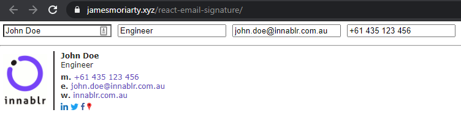

# React Email Signature

 

Interactive form to generate email signatures. [Example](https://jamesmoriarty.github.io/react-email-signature).



# Start

```
npm start
```

# Test

```
npm test
```

# Deploy

```
npm run deploy
```
